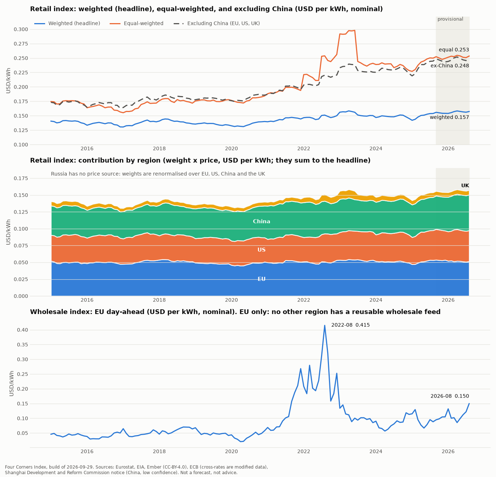

# STOP-2 — the index (G4)

*2026-09-30. Evidence: `evidence/G4.md`. Method: `METHOD.md` (v1, frozen before any value existed). Chart: `evidence/G4/index_chart.png`. Answer in this file (a commit) or in a PR comment. Nothing past G4 has been started except the UK source check (adapters wait for your answer).*

## The short version

- **Both indices are built, monthly from 2015-01 to 2026-08, from the raw snapshots, offline, byte-identically.** 280 ledger lines, hash-chained; the verifier passes and fails on a single edited value.
- **Retail** (EU + US + China, weights renormalised because Russia has no price): 100.74 in 2015-01, 111.73 in 2026-08; the equal-weighted variant is 133.8. 128 of 140 months are final, 12 provisional.
- **Wholesale** (EU only, labelled so): 106.1 in 2015-01, peak 0.415 USD/kWh in 2022-08, 346.0 in 2026-08. All months final.
- **Weighted and equal-weighted retail differ by a third** (0.153 vs 0.203 USD/kWh in 2026-08), because **China is 58.9% of the weighted index and its price is one constant tariff** (see 1).
- **One real risk: the raw snapshots (49 MB) exist only in this container** (see 2).

## What is in the numbers

**Weights** (Ember yearly Demand of the previous year among EU, US, China, Russia; Russia is in the denominator but has no price):

| year | EU | US | China | Russia | renormalised over EU / US / CN |
|---|---|---|---|---|---|
| 2015 | 20.4% | 30.1% | 41.8% | 7.7% | 22.1% / 32.6% / 45.3% |
| 2020 | 18.4% | 26.9% | 47.7% | 7.0% | 19.8% / 28.9% / 51.3% |
| 2026 | 14.6% | 23.9% | 55.3% | 6.2% | 15.6% / 25.5% / 58.9% |

**Notable moves.** Retail has **no** month-on-month move above 4% (largest +2.8%, 2023-01): the index is smooth because its largest weight is a constant tariff. Wholesale has 32 moves above 20%, each decomposed in `checks/explained_moves.md` into FX, local price, like-for-like price (same countries in both months) and country entries, then compared with two drivers we hold. Findings: FX explains almost nothing (at most 3.8%); 23 moves line up with the World Bank TTF gas price (the 2021-09 to 2023-01 crisis months match at 68% to 133% of the size of the move); 9 line up with a fall or rise in EU wind+solar share instead; **3 are only partly gas-aligned** (2017-01, 2020-06, 2025-03). Bulgaria's entry in 2016-10 is the one visible composition change. These are mechanical attributions, not proof of cause, and the file says so; the classification thresholds were set after a first look at the moves.

**Two rules found on the way, now in METHOD.md** (from G3): weights use Ember's *yearly* Demand and never mix with its monthly levels; Ember's Demand follows inland demand, not final consumption.

## Decisions and questions

### 1. China's weight versus China's data (the biggest one)
Over 2015 to 2026 the China contribution moves only with CNY/USD, because the price is one Shanghai first-tier tariff (0.617 CNY/kWh, per its 2012 notice; whether it was re-issued since is **not confirmed**). At 45% to 59% of the weighted index, the headline is largely a yuan exchange-rate series with an EU and US layer on top. You chose "A" at STOP-1 (publish as designed, badge C, equal-weighted variant and contributions on the headline page), and the build does exactly that. Options now that you can see it:
- **A (recommended):** keep as is, and add one more variant on the headline page: **retail index excluding China (EU + US only)**, so a reader can see the part that rests on measured prices. That is a new variant, so it needs your word.
- **B:** as A, plus a research task to confirm the Shanghai tariff is current and add more provinces (the source terms are unclear; the numbers would be dated facts, not mirrored files).
- **C:** leave it.

### 2. Raw snapshot persistence (needs you)
The 17 raw snapshots (49 MB, 7.8 MB gzipped) are in `raw_cache/` in this container. The manifest with every SHA-256 is committed; the bytes are not, and **they vanish when the container does**. I cannot upload Release assets from here and the card forbids committing large raw data. Consequence if nothing is done: the ledger's `inputs_sha256` will point at bytes nobody can recover, and rebuilds need a fresh fetch (sources revise, so results may differ). Options: **(a, recommended)** the first session with your `GITHUB_TOKEN` (write access to Releases) uploads the first snapshot; until then, accept that this launch backfill is reproducible only from the committed normalised series in `data/series/`, and I re-take a snapshot at the start of each session; **(b)** you authorise committing the 7.8 MB gzipped archive to git once as an exception; **(c)** you fetch and upload it yourself.

### 3. Assumptions you can overrule
- **EIA monthly prices are provisional for 12 months** (EIA's Electric Power Monthly calls the latest values "preliminary estimates"; I do not know its revision window). I can confirm it from EIA's documentation next session.
- **EU household is carried forward** for 2026-01 to 2026-08 (last published 2025-S2), which is why those months are provisional; the carry limit is 12 months.
- **No industrial index at launch**; industrial prices (EU band ID, with band IC beside it; US industrial; UK when added) appear on the regional pages. Say if you want an Industrial index.
- **Ledger `published` date is 2026-09-29 for the whole backfill**, marked `backfill: true`.

### 4. The explanations
Accept the mechanical attributions as the continuity evidence for G4? Weakest are the 9 renewables-only lines and the 3 partial-gas lines (all labelled). An alternative would be to leave them as "no established cause", which the gate treats as a defect; I chose to label rather than hide.

### 5. UK
Adapters for the UK (DESNZ QEP 5.6.2 household band DC, 5.4.2 non-household band ID, Ember GBR wholesale and mix; ECB GBP) are ready to start as G2b. The UK stays beside the basket. Go ahead?

## What I would do next
After your answers: UK adapters and tests (G2b, small); then **G5**, the static dashboard from `data/` (headline cards for both indices with status and as-of date, region cards with badges, mix and drivers strips, equal-weighted variant and contributions on the headline page, downloads, sources page, phone width, headless-browser tests, screenshots); then **G6**, the daily and Pages workflows with the failure path and a simulated 15th-of-month publication.

## Process note
G4 took three rounds: METHOD.md, then the build (first run of the real numbers, hand-checked against the raw inputs), then the continuity and reproducibility evidence. The evaluation that mattered was the hand recomputation of one month and the continuity decomposition: the second showed that 32 wholesale "moves" are almost entirely local price moves (not FX or composition), which is the property the continuity gate exists to establish. Details in `LOG.md`.

---

## Ziggy's answers (2026-09-30, in the session) and how the builder reads them

| # | Answer | Builder's reading and status |
|---|---|---|
| 1 | "add the ex-china variant" | Done (METHOD v2, committed before computing it). Retail excluding China went from 100.6 (2015-01) to **142.7** (2026-08) against the headline's 111.7, so the measured-price part of the index rose about 43% while the headline rose about 12%. Details: `evidence/G4b.md`. |
| 2 | "bringing the UK in as a weight bearing index if you're confident in the sources" | Household: confident (band identical to Eurostat DC, OGL, matches Eurostat's own UK series to four decimals in all 11 overlapping semesters). **UK wholesale: not confident** (Ember does not say whether it converts the UK price from sterling; no independent figure), so it stays out. The UK enters the Retail index at METHOD v3 once you rule on `reports/BLOCKED-G3b.md` (two 2020-S1 rows that differ from Eurostat by 0.0007 and 0.0010 GBP/kWh; the series the index uses matches in all eleven). |
| 3 | "commit it once" (the raw archive) | Done: `snapshots/raw_2026-09-29.tar.gz`, 8.45 MB, 21 files, deterministic, with a verified restore; rebuilds from it are byte-identical with the network blocked, and that test now runs in CI. |
| 4 | "don't see a need to override any" | Assumptions stand. |
| 5 | "Anything else you might need from me?" | See the chat reply: only the G3b ruling; and, before G6, the Actions workflow permissions setting (repo settings, which the builder must not change). |
